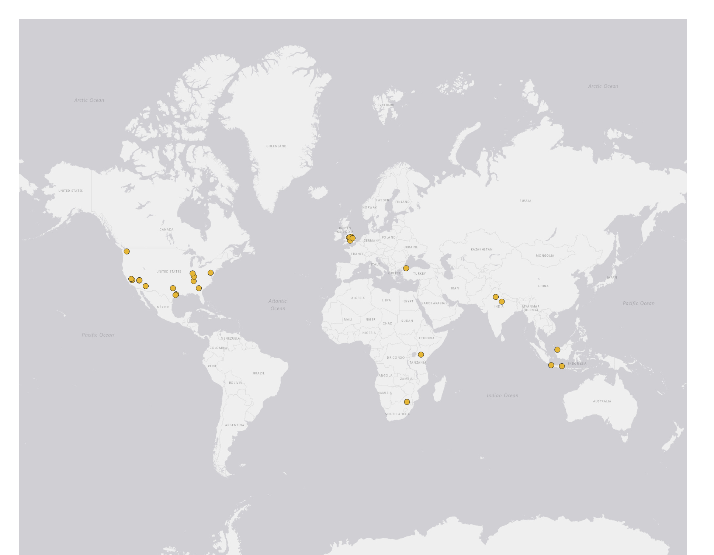

# Geo-tagged tweet collection and visualization

In this practical exercise, I collected geo-tagged Twitter data using an API-based crawler and visualize them on a map using a mapping tool QGIS. The map below tracked the twitter posts that were posted on `Sat Apr 18 17:49:22 +0000 2020`and mentioned the word `happy`. To filter my search, I used `stream.filter(track=['happy'])`.

According to the map, it seams like Twitter users in U.S., Europe, India, South Asia, and Africa have some good news to share with the world!
